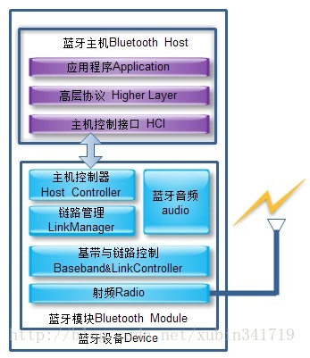
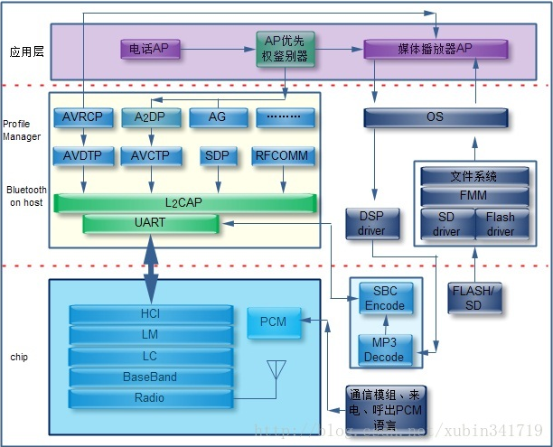
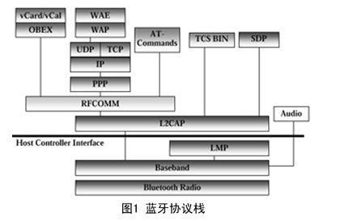
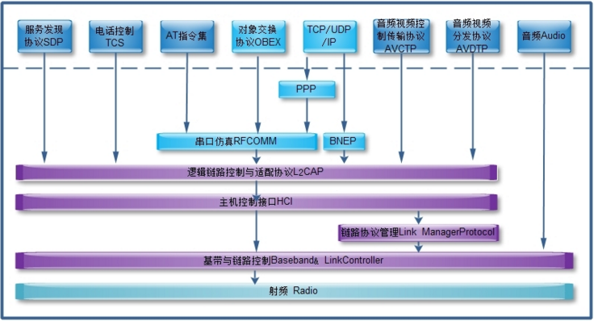
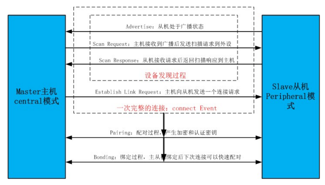
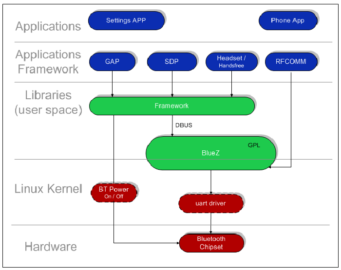
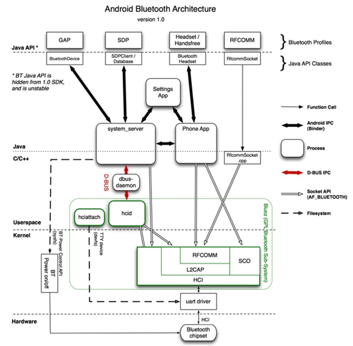

# Bluetooth

## 无线通信
无线通信是利用电波信号可以在自由空间那种传播的特性进行信息交换的一种通信方式。在移动中实现的无线通信又通称为移动通信，人们把二者合称为无线移动通信。简单讲，无线通信是仅利用电磁波而不通过线缆进行的通信方式。电子信号从发射器到达天线，然后天线将信号作为一系列电磁波发射到空气中，信号通过空气传播，直到它到达目标位置为止。在目标位置，另一个天线接收信号，一个接收器将它转换回电流信号。

## 定义
一种无线通讯技术标准，用来让固定与移动设备，在短距离间交换数据，以形成个人局域网（PAN）。其使用**短波特高頻（UHF）无线电波**，经由2.4至2.485 GHz的ISM频段来进行通信[1]。1994年由电信商爱立信（Ericsson）发展出这个技术[2]。它最初的设计，是希望创建一个RS-232数据线的无线通信替代版本。它能够链接多个设备，克服同步的问题。蓝牙技术当前由蓝牙技术联盟（SIG）来负责维护其技术标准，其成员已超过三万，分布在电信、电脑、网络与消费性电子产品等领域[3]。IEEE曾经将蓝牙技术标准化为IEEE 802.15.1，但是这个标准已经不再继续使用。蓝牙采用分散式网路结构以及快调频和短包技术，支持点对点以及点对多点通信，采用时分双工传输方案实现全双工传输。

## 蓝牙通信机制
- 蓝牙通信也采用socket机制，通信双方一方为服务器端，另一方为客户端。**主动发起通信请求的一方便是客户端，另一方便是服务器端。**

## 蓝牙通信的工作流程
- 服务器端先建立一个服务器端套接字socket,然后该套接字开始监听客户端的连接。
- 客户端也建立一个socket，然后向服务器发起连接，这时候如果没有异常就算两个设备连接成功了。
- 客户端和服务器端都会持有一个socket，利用该socket可以发送和接收消息。

## 蓝牙系统构成

- 无线射频单元(Radio):负责射频信号的发送和接收，特点是短距离、低功耗。蓝牙天线一般体积小，重量轻，属于微带天线。
- 基带或链路控制单元(Link Ccontroller):进行射频信号与数字或语音信号的相互转换，实现基带协议和其他的底层连接规程。
- 链路管理单元(Link Manager):负责管理蓝牙设备之间的通信，实现链路的建立，验证，配置链路等操作。
- 蓝牙软件协议

## 蓝牙协议
- 蓝牙协议架构：

- 蓝牙协议体系中的协议按SIG的关注程度分为4层：
   - 核心协议：BaseBand,LMP,L2CAP,SDP
   - 电缆替代协议：RFCOMM
   - 电话传送控制协议：TCS-Binary、AT命令集
   - 选用协议：PPP，UDP/TCP/IP、OBEX、vCard、vCal、IrMC、WAE

## 蓝牙Profile
- **概述**：从3.0版本开始，蓝牙才开始支持BluetoothProfile。Bluetoothprofile是蓝牙设备间数据通信的无线接口规范。想要使用蓝牙无线技术，设备必须能够翻译特定蓝牙配置文件，配置文件定义了可能的应用。蓝牙配置文件表达了一般行为，蓝牙设备可以通过这些行为与其他设备进行通讯。
- 配置文件包含信息：
   - 与其他配置文件的相关性
   - 建议的用户界面格式
   - 配置文件使用的蓝牙协议堆栈的特定部分

- 常见基本配置文件：
   - **通用访问配置文件**(Generic Access Profile,GAP)，GAP是其他所有配置文件的基础，它定义了在蓝牙设备间建立基带链路的通用方法。除此之外，GAP还定义如下内容：
      - 必须在所有蓝牙设备中实施的功能
      - 发现和链接设备的通用步骤
      - 基本用户界面术语
   - **服务发现应用配置文件**（Service Discovery Application Profile，SDAP），SDAP描述了应用程序如何使用SDP发现远程设备上的服务。由于GAP 的要求，任何蓝牙设备都应能够连接至其他蓝牙设备。基于此，SDAP要求任何应用程序都应当能够发现它要连接的其他蓝牙设备上的可用服务。此配置文件，可承担搜索已知和特定服务以及一般的任务。SDAP涉及了称为“服务发现用户应用程序”的一个应用程序，这是蓝牙设备查找服务所必需的。此应用程序可与向/从其他蓝牙设备发送/接收服务查询的SDP相接。SDAP依赖于GAP，并可以重新使用部分GAP
   - **串行端口配置文件**(Serial Port Profile,SPP),SPP定义了如何设置虚拟串行端口以及连接两个蓝牙设备。SPP基于ETSI TS 0.10规格，使用RFCOMM协议提供串行商品仿真。SPP提供了以无线方式替代现有的RS-232串行通信应用程序和控制信号的方法。SSP为DUN,FAX,HSP和LAN配置文件提供了基础。此配置文件可以支持最高128kb/s的数据率。SSP依赖于GAP。
   - **通用对象交换配置文件**(Generic Object Exchange Profile,GOEP），GOEP可用于将对象从一个设备传输到另一个设备。对象可以使任意的。如图片，文档，名片等。此配置文件定义了两个角色：提供拉提或者推送对象位置的服务器以及启动操作的客户端。使用GOEP的应用程序假定链路和信道已按GAP的定义建立。GOEP依赖于串行口端口配置文件。
   
- 蓝牙Profile框架
每个attribute属性被UUID唯一标识，UUID是标准128-bit格式的ID用来唯一标识信息。attribute被ATT格式化characteristics和services形式进行传送。
   - 特征(characteristics):一个characteristics包含一个单独的value和0-n个用来描述characteristics值(value)的descriptors.一个characteristics可以被认定是一种类型的，类似于一个类。
   - 描述符(descriptor):descriptor是被定义的一个attributes,用来描述一个characteristics 的值。例如，一个descriptor可以指定一个人类可读的描述中，在可接受范围里characteristics值，或者是测量单位，用来明确characteristics的值。
   - 服务(service):service 是characteristics 的集合。例如，你可以有一个所谓的“Heart RateMonitor”service，其中包括characteristic，如“heart rate measurement”。

## 连接建立过程

## Android Bluetooth架构
- 面向库的架构视图

- 面向进程的架构视图

## 参考
https://zh.wikipedia.org/wiki/%E8%97%8D%E7%89%99

https://www.cnblogs.com/kevin-yin/p/9068630.html

https://blog.51cto.com/9105034/1831110

https://www.cnblogs.com/beyondlpf/p/10008871.html
